<link rel="stylesheet" href="./style.css"/>

# 반응형 네이버 로그인 페이지 구현 및 웹 표준 & 접근성에 기반한 취약점 분석 및 개선안 적용

    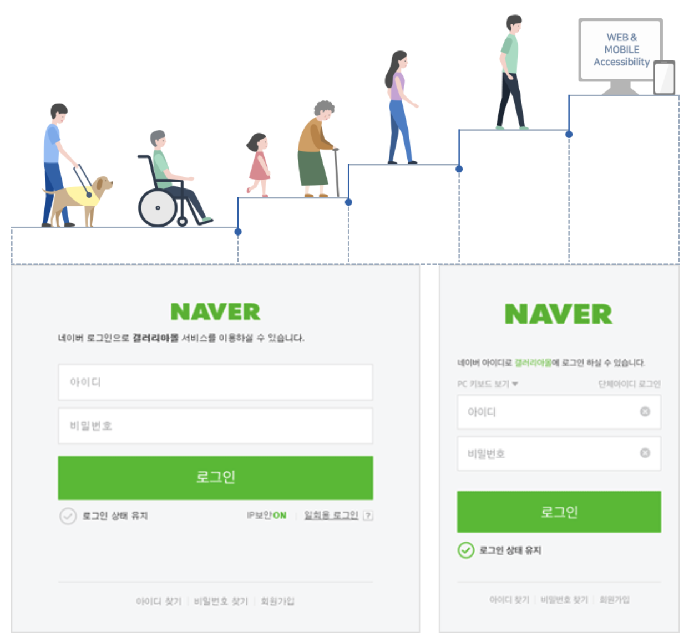

<section>
    <h2><b>Project Status</b></h2>

🗓️ 2021.02.28(Sun)

**(1) Issue1) README 파일에 프로젝트 초기 Task 작성하기**

→ [https://github.com/LeeHyungi0622/responsive-naver-login-page-with-web-standards-and-accessibility/issues/1](https://github.com/LeeHyungi0622/responsive-naver-login-page-with-web-standards-and-accessibility/issues/1)

**(2) Issue2) 네이버 로그인 페이지 레이아웃 설계하기**

→ [https://github.com/LeeHyungi0622/responsive-naver-login-page-with-web-standards-and-accessibility/issues/2](https://github.com/LeeHyungi0622/responsive-naver-login-page-with-web-standards-and-accessibility/issues/2)

**(3) Issue3) 웹 표준 및 접근성에 기반한 기존 로그인 페이지의 취약점 분석 및 개선안 정리하기**

→ [https://github.com/LeeHyungi0622/responsive-naver-login-page-with-web-standards-and-accessibility/issues/3](https://github.com/LeeHyungi0622/responsive-naver-login-page-with-web-standards-and-accessibility/issues/3)

**(4) Issue4) BEM 방식으로 element 클래스 이름작성하기**

→ [https://github.com/LeeHyungi0622/responsive-naver-login-page-with-web-standards-and-accessibility/issues/4](https://github.com/LeeHyungi0622/responsive-naver-login-page-with-web-standards-and-accessibility/issues/4)

**(5) Issue10) Initial project setup**

→ [https://github.com/LeeHyungi0622/responsive-naver-login-page-with-web-standards-and-accessibility/issues/10](https://github.com/LeeHyungi0622/responsive-naver-login-page-with-web-standards-and-accessibility/issues/10)

**(6) Issue12) 네이버 로그인 페이지 기본 레이아웃 작성하기**

→ [https://github.com/LeeHyungi0622/responsive-naver-login-page-with-web-standards-and-accessibility/issues/12](https://github.com/LeeHyungi0622/responsive-naver-login-page-with-web-standards-and-accessibility/issues/12)

**(7) Issue14) 작성한 기본 레이아웃에 스타일 적용시키기**

→ [https://github.com/LeeHyungi0622/responsive-naver-login-page-with-web-standards-and-accessibility/issues/14](https://github.com/LeeHyungi0622/responsive-naver-login-page-with-web-standards-and-accessibility/issues/14)

🗓️ 2021.03.01(Mon)

**(8) Issue16) 로그인 상태 유지 및 IP 보안 ON/OFF 체크박스 수정하기**

→ [https://github.com/LeeHyungi0622/responsive-naver-login-page-with-web-standards-and-accessibility/issues/16](https://github.com/LeeHyungi0622/responsive-naver-login-page-with-web-standards-and-accessibility/issues/16)

**(9) Issue5) 개선안 3을 위한 CSS 이벤트 처리관련 조사 및 구현**

→ [https://github.com/LeeHyungi0622/responsive-naver-login-page-with-web-standards-and-accessibility/issues/5](https://github.com/LeeHyungi0622/responsive-naver-login-page-with-web-standards-and-accessibility/issues/5)

**(10) Issue19) 반응형 웹 페이지 구현하기**

→ [https://github.com/LeeHyungi0622/responsive-naver-login-page-with-web-standards-and-accessibility/issues/19](https://github.com/LeeHyungi0622/responsive-naver-login-page-with-web-standards-and-accessibility/issues/19)

**(11) Issue21) Project Reflection 작성하기**

→ [https://github.com/LeeHyungi0622/responsive-naver-login-page-with-web-standards-and-accessibility/issues/21](https://github.com/LeeHyungi0622/responsive-naver-login-page-with-web-standards-and-accessibility/issues/21)

</section>

# **레이아웃 설계**

Contents의 논리적 흐름을 나타내는 논리 구조도와 레이아웃 요소 배치도 작성

<table>
    <tr>
        <td>
            
        </td>
    </tr>
    <tr>
        <td align="center">
            < 네이버 로그인 화면 레이아웃 설계 >
        </td>
    </tr>
</table>

<section>
<b>
    <ins>
        <h2>웹 표준 및 접근성에 기반한 취약점 분석 및 개선안</h2>
    </ins>
</b>

<section>
<h2><b>개선안 1)</b></h2> 현재 페이지의 header 부분이 native HTML5 element인 header 태그를 사용하지 않고 div태그에 id로 “header”를 지정하고 있다.  
이런 경우에는 native HTML5 element인 header를 사용하거나 div태그내에 ARIA Landmark role로 “banner” 속성값을 지정해주는 것이 좋을 것 같다.

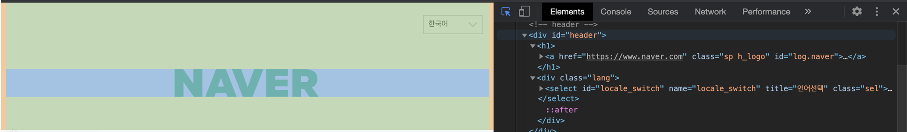

[https://www.w3.org/TR/wai-aria-practices/examples/landmarks/HTML5.html](https://www.w3.org/TR/wai-aria-practices/examples/landmarks/HTML5.html)

</section>

<section>
<h2><b>개선안 2)</b></h2> 기존 네이버 로그인 페이지의 contents의 논리적 흐름을 살펴보면 하단의 표에서 가장 좌측(개선안 적용 전)과 같은 순서로 이동하는 것을 알 수 있다. 각 contents의 순서상의 개선안과 태그 속성상의 개선안을 생각해보았다.    
생각해 본 개선안을 적용한 후의 결과는 하단의 표에서 가장 우측(개선안 적용 후)와 같은 결과로 변경된다.

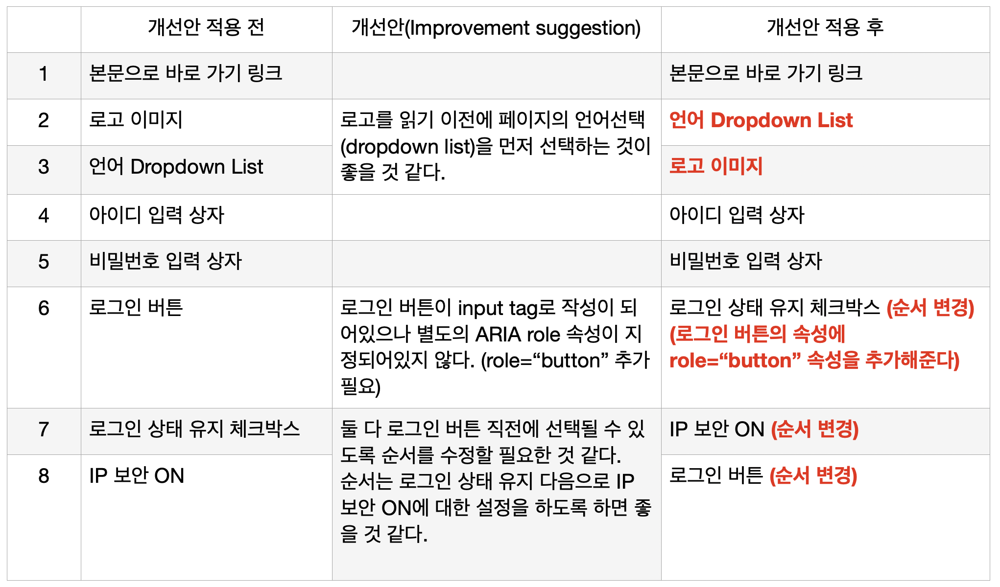
</section>

<section>
<h2><b>개선안</b> 3)</h2>하나의 input tag에는 하나의 의미있는 label을 mapping 시켜주도록 개선하자.

[https://www.w3.org/TR/WCAG20-TECHS/H44.html](https://www.w3.org/TR/WCAG20-TECHS/H44.html)

현재 네이버의 로그인 화면에서 id와 password 입력란을 보면, \<label> 태그에는 z-index값이 8, \<input> 태그에는 z-index값이 9 로 지정되어 있다. 따라서 화면 배치상 \<label> 태그는 항상 \<input> 태그의 뒤에 위치하게 되므로 \<label> 태그에 표시된 내용은 의미가 없다. 결국에 \<input> 태그의 placeholder에 넣어준 텍스트만 \<input> 태그에 표시되는 것이다. 이렇게 되면, 경우에 따라 스크린 리더가 input태그의 뒤에 숨겨진 label의 텍스트와 placeholder 텍스트를 연달아서 두 번 읽어주게 된다.

조사를 해보니, JAWS와 NVDA와 같은 스크린 리더의 경우에는 placeholder를 읽어주지 않는다고 한다. 지금은 단순히 아이디와 패스워드를 입력하는 \<input>태그를 다루고 있지만 만약에 구체적인 format의 데이터 입력을 요구하는 경우에는 반드시 시각장애인이 해당 입력 태그에 어떤 format의 데이터를 입력해줘야 하는지를 알려줘야 한다.

스크린 리더에 따라 읽어주기도 하고, 읽어주지 않기도 한다면 안정적으로 placeholder가 아닌 label에 입력해야하는 데이터에 대한 정보를 넣어주고, \<input>태그의 위에 중첩시켜서 마치 placeholder와 같이 표시해준다음 입력 태그에 input cursor가 focus되는 경우, label 텍스트를 축소시켜서 입력태그의 상단에 표시될 수 있도록 CSS 효과를 주는 것도 좋은 방법인 것 같다.  
(구체적인 데이터의 입력 format은 경우에 따라 placeholder에 입력해서 처리해주면 된다)

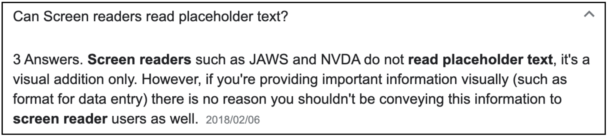

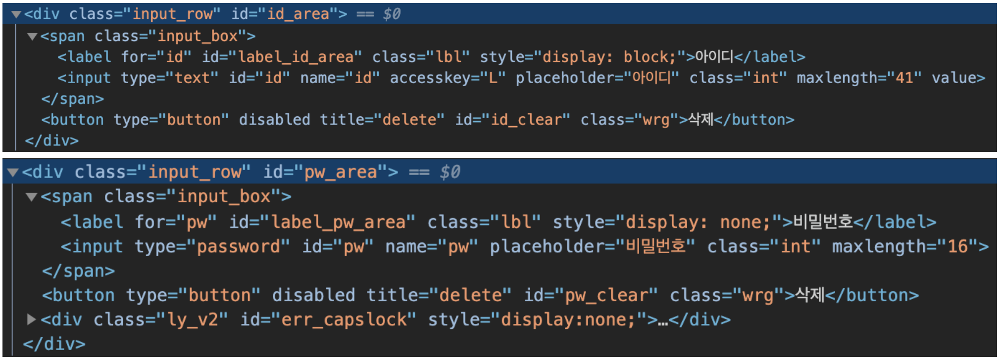

<table>
    <tr>
        <td>
            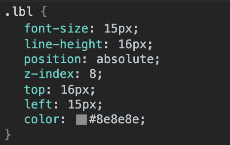
        </td>
        <td>
            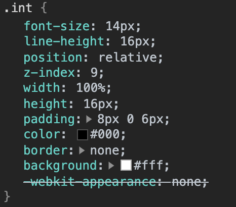
        </td>
    </tr>
    <tr>
        <td align="center">
            <b>개선안 적용 전) Label CSS 스타일</b>
        </td>
        <td align="center">
            <b>개선안 적용 전) input 태그 스타일</b>
        </td>
    </tr>
</table>

</section>

</section>

<section>

# **BEM 방식으로 element의 클래스 이름 작성하기**

<table>
    <tr>
        <td>
            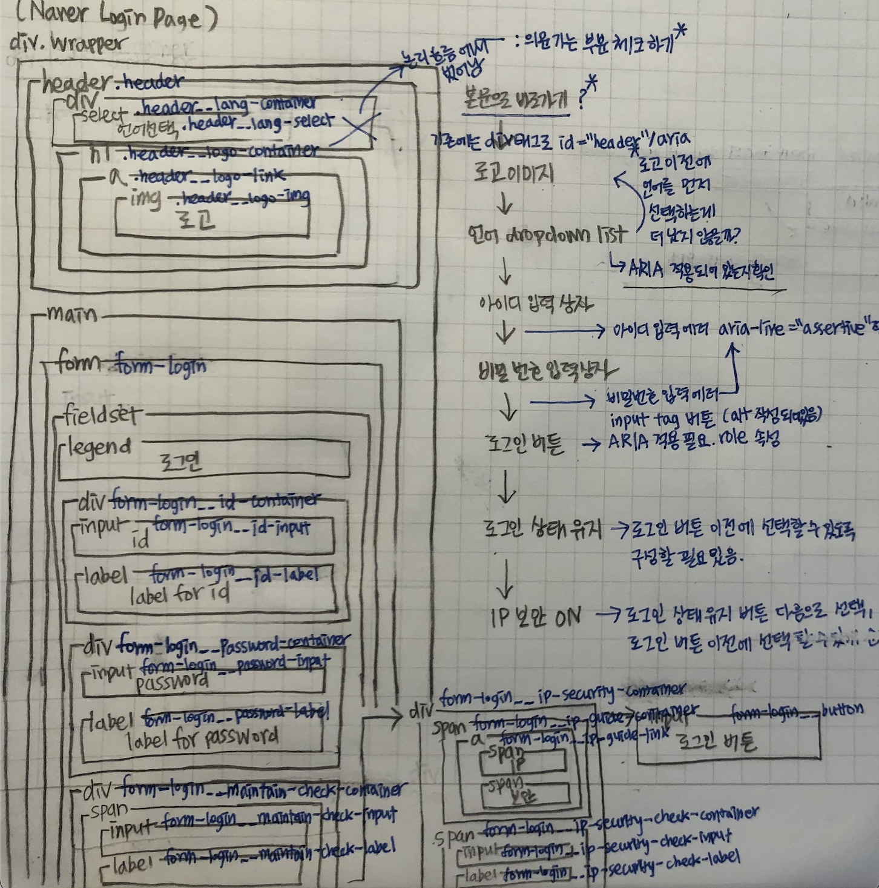
        </td>
    </tr>
    <tr>
        <td align="center">
            < BEM 방식으로 클래스 이름 정하기 >
        </td>
    </tr>
</table>

</section>

<section>

# **네이버 로그인 페이지 기본 레이아웃 작성하기**

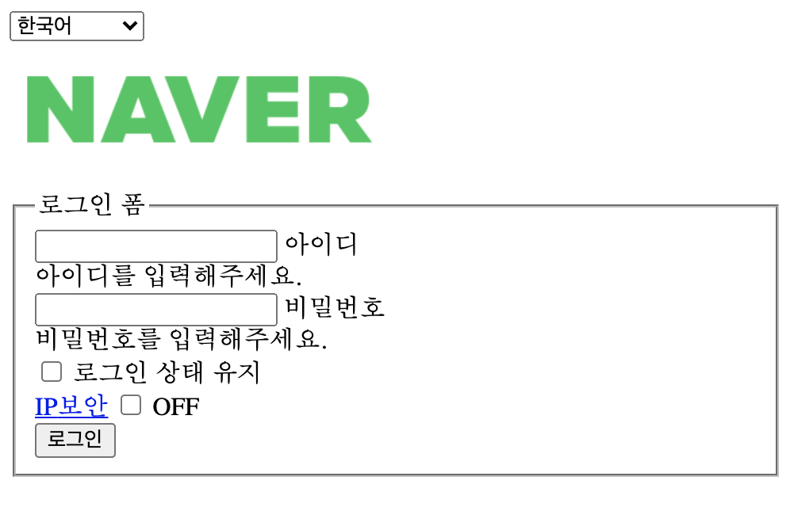

</section>

<section>

# **기본 레이아웃에 스타일 적용하기**

<table>
    <tr>
        <td>
            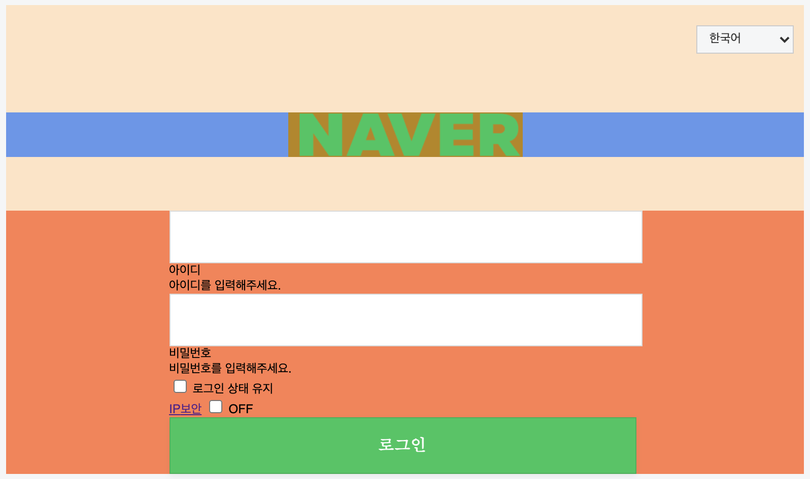
        </td>
        <td>
            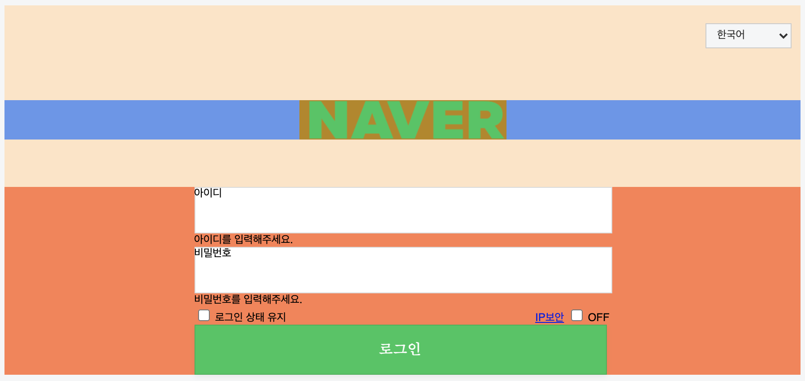
        </td>
    </tr>
    <tr>
        <td>
            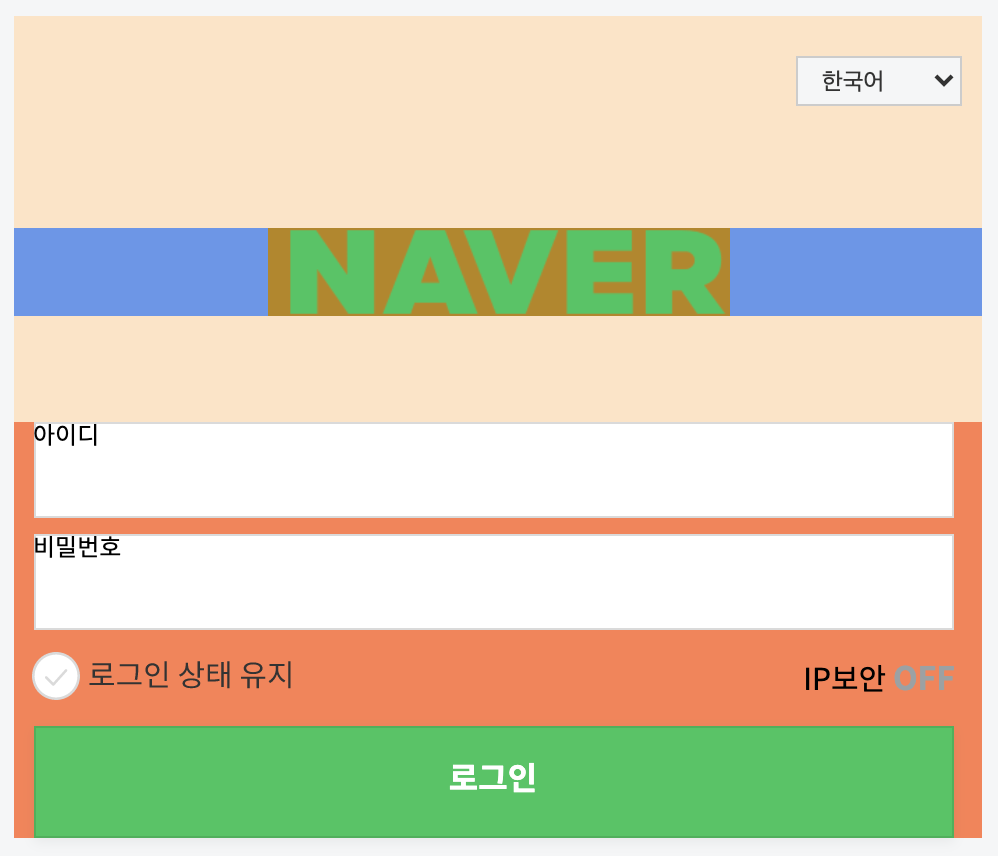
        </td>
        <td>
            
        </td>
    </tr>
</table>

</section>

<section>

# **개선안 3) 하나의 input tag에는 하나의 <ins>의미있는</ins> label을 mapping 시켜주도록 개선한다.**

<ins><b>입력 태그에 CSS 이벤트 구현</b></ins>

기존에는 label 태그를 input 태그의 뒤에 z-index 속성을 사용하여 보이지 않도록 처리하였다.
개선한 부분은 input 태그의 placeholder에 표시한 hint 텍스트를 label 태그에 표시하도록 수정하였다.

표시된 label 태그는 input 태그가 focus 상태일 때와 valid 상태일 때, out-focusing 상태일 때 보다 글자 크기를 작게 하여 좌측 상단에 배치될 수 있도록 이벤트 처리하였다.

이렇게 되면 기존에는 경우에 따라 label의 텍스트와 placeholder의 텍스트 모두 스크린 리더가 읽어주는 경우가 생기는데 이를 해결할 수 있으며, 태그와 placeholder의 역할을 분리해야 되는 경우(입력해야 되는 데이터의 format을 알려줘야 하는 경우)를 해결할 수 있다고 생각한다.

<table>
    <tr>
        <td>
            
        </td>
        <td>
            
        </td>
    </tr>
    <tr>
        <td align="center">
            < 초기 로그인 페이지 상태 >
        </td>
        <td align="center">
            < input 태그(아이디 입력)에 focus가 된 경우 >
        </td>
    </tr>
    <tr>
        <td>
            
        </td>
        <td>
            
        </td>
    </tr>
    <tr>
        <td align="center">
            < input 태그(비밀번호 입력)에 focus가 된 경우 >
        </td>
        <td align="center">
            < input 태그(아이디 & 비밀번호 입력)가 valid state인 경우 >
        </td>
    </tr>
</table>

</section>

<section>

# **반응형 웹 페이지 구현(Responsive web page)**

<table>
    <tr>
        <td>
            
        </td>
        <td>
            
        </td>
    </tr>
    <tr>
        <td align="center">
            < 데스크탑(너비가 769px이상) 대응 >
        </td>
        <td align="center">
            < 모바일(너비가 768px이하) 대응 >
        </td>
    </tr>
</table>

</section>

<section>

# **Project Reflection**

Q1.&nbsp;<b>이 프로젝트를 하게 ëœ 배경은 무엇인가?</b>  
→ 이 프로젝트는 강사님이 내주신 HTML/CSS 과제의 일환으로써 하게 되었다. 과제는 반응형 네이버 로그인 페이지 레이아웃 작성이라는 단순한 주제였다. 하지만 이번 HTML/CSS 수업을 듣고 나서 HTML과 CSS를 바라보는 나의 시각이 달라졌고, 나에게는 단순한 레이아웃 작성이 아닌 다른 의미로 다가왔다. 그래서 기존 네이버 로그인 페이지를 분석하기 시작했고, 내가 생각한 개선점을 반영하여 네이버 로그인 페이지를 재구성 해보았다.

Q2.&nbsp;<b>무엇을 만들기 위한 목적으로 개발되었나요?</b>  
→ 단순히 무엇을 만들기 위한 목적이 아닌 기존에 서비스를 하고 있는 웹 사이트의 일부 (로그인 페이지)를 분석하고 어떠한 개선점이 필요한지 웹 표준과 접근성의 측면에서 분석하고 생각한 개선점을 적용하여 기존의 페이지를 재구성해보았다.

Q3.&nbsp;<b>이 프로젝트를 통해서 얻고자 하는 것과 개발경험에 있어, 어떤 부분이 도움이 되었는가?</b>  
→ 기존에는 레이아웃 작성에 대해서 나는 쉽고 빠르게 레이아웃을 작성하는 것에 의미를 두었었다. 하지만 그 생각이 잘못되었다는 것을 깨달았다. 이번 프로젝트를 하면서 가장 큰 수확은 레이아웃을 웹 표준과 접근성의 측면에서 바라보는 연습을 한 것이었다. 그리고 반응형 웹 페이지 구성을 할때에는 내부 컨텐츠를 또 다른 wrapper container로 감싸서 처리를 해줘야 된다는 것 그리고 스타일링을 하면서 클래스의 구체성의 중요성에 대해서 다시 깨닫게 되었다.

Q4.&nbsp;<b>프로젝트 진행중에 예상치 못했던 어려움이 있었나?</b>  
→ 물론 있었다. 우선 반응형 페이지 구성을 위해 별도의 media 태그로 기존의 스타일을 재 정의할때 문제가 있었다. 바로 클래스의 구체성 문제였다. 기존에 선택자를 좀 더 구체적으로 스타일하고 media 태그내에서는 그보다는 덜 구체적으로 선택자를 잡아서 스타일링을 했더니 사이즈 변화에 맞게 일부 스타일링이 적용되지 않았었다. 그리고 모바일 대응 웹 페이지 구성을 위해서는 내부 컨텐츠들을 또 다른 wrapper container로 감싸서 처리해주는 것이 내부 컨텐츠 정렬에 있어 유용하다는 것을 배웠다.

Q5.&nbsp;<b>이 프로젝트를 구현함에 있어 사용했던 도구/라이브러리는 무엇입니까?</b>  
→ 이 프로젝트를 구현할때는 우선 디자인적인 스타일링 요소를 확인하기 위해 Figma라는 어플리케이션을 활용하였다.

</section>

</section>
